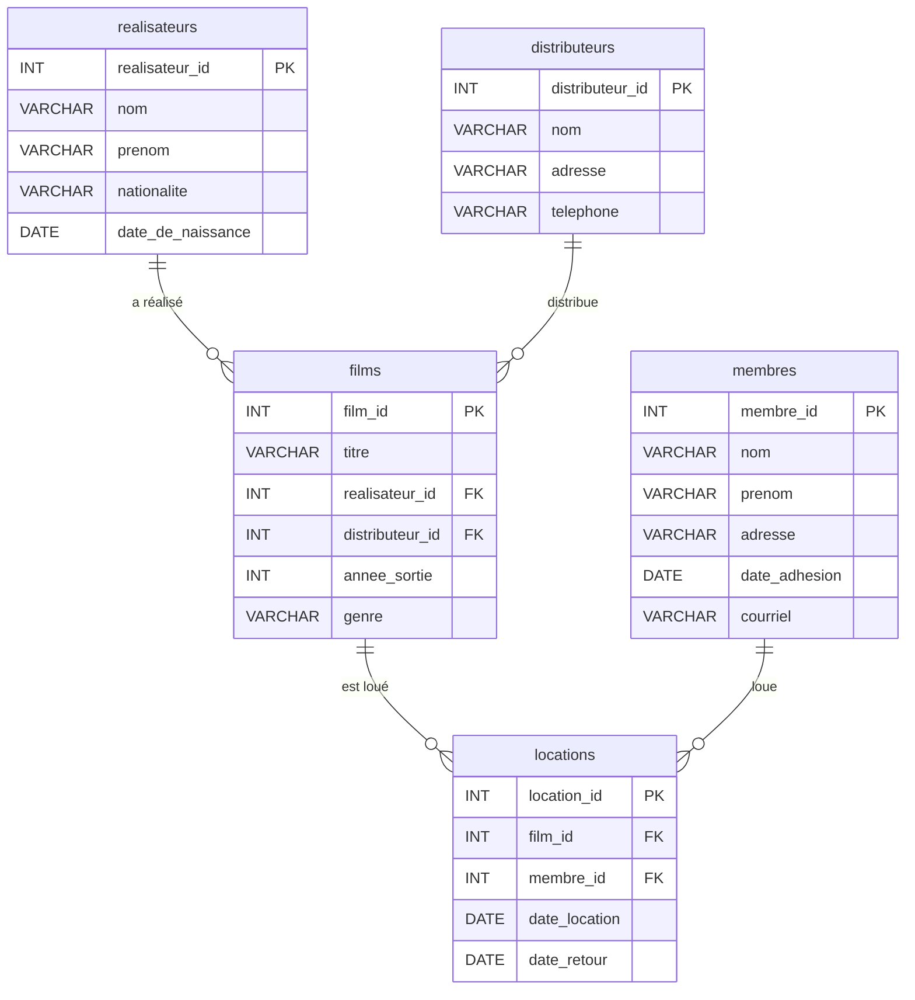
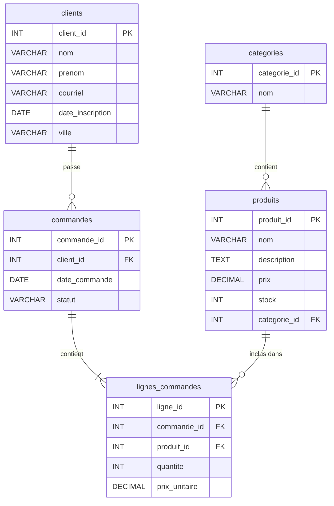

# Exercices de pratique — Fonctions, déclencheurs et procédures stockées

## Modèles de bases de données

### Modèle 1 — Club vidéo



---

### Modèle 2 — Boutique en ligne



---

## Scripts SQL

Téléchargez et exécutez le script correspondant au modèle pour créer la base de données et ses données de test.

- [club\_video.sql](../club_video.sql) — Modèle Club vidéo
- [boutique\_en\_ligne.sql](../boutique_en_ligne.sql) — Modèle Boutique en ligne

---

## Partie 1 — Club vidéo

### Exercice 1 — Fonction

**Modèle :** Club vidéo

Créez une fonction qui retourne le nombre de locations effectuées par un membre.

**Paramètre :** `membre_id` (INT)  
**Valeur de retour :** le nombre de locations du membre (INT)

**Exemples d'exécution :**

| membre_id | Résultat attendu |
|-----------|-----------------|
| 1 | 4 |
| 7 | 0 |

??? example "Réponse"

    ```mysql
    /**
     * Retourne le nombre de locations effectuées par un membre.
     *
     * @param _membre_id  INT  Identifiant du membre
     * @return Le nombre de locations du membre
     */
    DELIMITER $$

    CREATE FUNCTION nombre_locations_membre(_membre_id INT) RETURNS INT NOT DETERMINISTIC READS SQL DATA
    BEGIN
        DECLARE _nombre INT;
        SET _nombre = (
            SELECT COUNT(*)
            FROM locations
            WHERE membre_id = _membre_id
        );
        RETURN _nombre;
    END $$

    DELIMITER ;
    ```

    Pour exécuter la fonction :

    ```mysql
    SELECT nombre_locations_membre(1);
    ```

---

### Exercice 2 — Déclencheur

**Modèle :** Club vidéo

Créez un déclencheur qui, lors de l'**insertion** d'une nouvelle location, vérifie que la `date_retour` n'est pas antérieure à la `date_location`. Si c'est le cas, mettez `date_retour` à `NULL`.

??? example "Réponse"

    ```mysql
    /**
     * Avant l'insertion d'une location, s'assure que la date de retour
     * n'est pas antérieure à la date de location. Si c'est le cas,
     * la date de retour est mise à NULL.
     *
     * @dependencies locations
     */
    DELIMITER $$

    CREATE TRIGGER valider_date_retour BEFORE INSERT ON locations FOR EACH ROW
    BEGIN
        IF NEW.date_retour IS NOT NULL AND NEW.date_retour < NEW.date_location THEN
            SET NEW.date_retour = NULL;
        END IF;
    END $$

    DELIMITER ;
    ```

---

### Exercice 3 — Procédure stockée

**Modèle :** Club vidéo

Créez une procédure pour enregistrer la location d'un film par un membre. La procédure insère une nouvelle ligne dans la table `locations` avec la date du jour comme `date_location` et `NULL` comme `date_retour`.

**Paramètres :** `membre_id` (IN), `film_id` (IN)  
**Valeur de retour :** l'identifiant de la location créée (OUT)

??? example "Réponse"

    ```mysql
    /**
     * Enregistre la location d'un film par un membre.
     *
     * @param IN   _membre_id    INT  Identifiant du membre
     * @param IN   _film_id      INT  Identifiant du film
     * @param OUT  _location_id  INT  Identifiant de la location créée
     */
    DELIMITER $$

    CREATE PROCEDURE louer_film(IN _membre_id INT, IN _film_id INT, OUT _location_id INT)
    BEGIN
        INSERT INTO locations (film_id, membre_id, date_location, date_retour)
            VALUES (_film_id, _membre_id, CURDATE(), NULL);

        SET _location_id = LAST_INSERT_ID();
    END $$

    DELIMITER ;
    ```

    Pour exécuter la procédure :

    ```mysql
    SET @location_id = 0;
    CALL louer_film(3, 12, @location_id);
    SELECT @location_id;
    ```

---

## Partie 2 — Boutique en ligne

### Exercice 4 — Fonction

**Modèle :** Boutique en ligne

Créez une fonction qui calcule le total d'une commande, c'est-à-dire la somme de `quantite * prix_unitaire` pour toutes les lignes de commande associées.

**Paramètre :** `commande_id` (INT)  
**Valeur de retour :** le montant total de la commande (DECIMAL(10,2))

**Exemples d'exécution :**

| commande_id | Résultat attendu |
|-------------|-----------------|
| 1 | 134.95 |
| 5 | 49.99 |

??? example "Réponse"

    ```mysql
    /**
     * Calcule le montant total d'une commande.
     *
     * @param _commande_id  INT  Identifiant de la commande
     * @return Le montant total de la commande (DECIMAL)
     */
    DELIMITER $$

    CREATE FUNCTION total_commande(_commande_id INT) RETURNS DECIMAL(10,2) NOT DETERMINISTIC READS SQL DATA
    BEGIN
        DECLARE _total DECIMAL(10,2);
        SET _total = (
            SELECT SUM(quantite * prix_unitaire)
            FROM lignes_commandes
            WHERE commande_id = _commande_id
        );
        RETURN IFNULL(_total, 0.00);
    END $$

    DELIMITER ;
    ```

    Pour exécuter la fonction :

    ```mysql
    SELECT total_commande(1);
    ```

---

### Exercice 5 — Déclencheur

**Modèle :** Boutique en ligne

Créez un déclencheur qui, **après l'insertion** d'une nouvelle ligne de commande, décrémente le stock du produit concerné du nombre d'unités commandées.

??? example "Réponse"

    ```mysql
    /**
     * Après l'insertion d'une ligne de commande, décrémente le stock
     * du produit du nombre d'unités commandées.
     *
     * @dependencies lignes_commandes, produits
     */
    DELIMITER $$

    CREATE TRIGGER decremente_stock AFTER INSERT ON lignes_commandes FOR EACH ROW
    BEGIN
        UPDATE produits
            SET stock = stock - NEW.quantite
            WHERE produit_id = NEW.produit_id;
    END $$

    DELIMITER ;
    ```

---

### Exercice 6 — Procédure stockée

**Modèle :** Boutique en ligne

Créez une procédure pour créer une nouvelle commande pour un client. La procédure insère une nouvelle ligne dans la table `commandes` avec la date du jour et le statut `en traitement`.

**Paramètre :** `client_id` (IN)  
**Valeur de retour :** l'identifiant de la commande créée (OUT)

??? example "Réponse"

    ```mysql
    /**
     * Crée une nouvelle commande pour un client avec la date du jour
     * et le statut 'en traitement'.
     *
     * @param IN   _client_id    INT  Identifiant du client
     * @param OUT  _commande_id  INT  Identifiant de la commande créée
     */
    DELIMITER $$

    CREATE PROCEDURE creer_commande(IN _client_id INT, OUT _commande_id INT)
    BEGIN
        INSERT INTO commandes (client_id, date_commande, statut)
            VALUES (_client_id, NOW(), 'en traitement');

        SET _commande_id = LAST_INSERT_ID();
    END $$

    DELIMITER ;
    ```

    Pour exécuter la procédure :

    ```mysql
    SET @commande_id = 0;
    CALL creer_commande(5, @commande_id);
    SELECT @commande_id;
    ```
