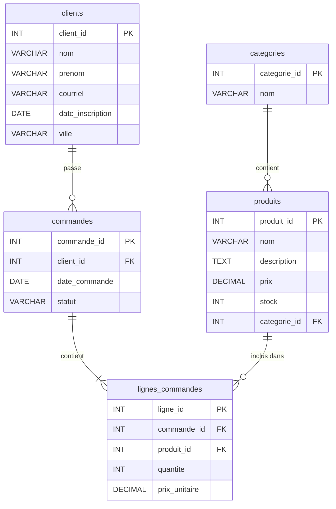

# Exercices de pratique — Requêtes SQL

Ces exercices couvrent les mêmes habiletés que l'examen pratique : création de structures, manipulation de données, sélection et correction de requêtes.

---

## Modèles de bases de données

### Modèle 1 — Club vidéo

*Utilisé pour les exercices 1, 2, 3, 6, 7, 8, 10, 11, 12, 13, 14, 15, 16, 19*


---

### Modèle 2 — Boutique en ligne

*Utilisé pour les exercices 4, 5, 9, 17, 18, 20*



---

## Partie 1 — Création et manipulation de structures

### Exercice 1

**Modèle :** Club vidéo

=== "Question"

    Écrivez la requête pour créer la table `membres`. Les clés primaires non composées de type entier doivent être auto-incrémentées.

    | Type | Colonne | Contrainte |
    |------|---------|------------|
    | INT | membre_id | PK |
    | VARCHAR(255) | nom | NOT NULL |
    | VARCHAR(255) | prenom | NOT NULL |
    | VARCHAR(255) | adresse | |
    | DATE | date_adhesion | |
    | VARCHAR(255) | courriel | |

=== "Réponse"

    ```mysql
    CREATE TABLE membres (
        membre_id INT PRIMARY KEY AUTO_INCREMENT,
        nom VARCHAR(255) NOT NULL,
        prenom VARCHAR(255) NOT NULL,
        adresse VARCHAR(255),
        date_adhesion DATE,
        courriel VARCHAR(255)
    );
    ```

---

### Exercice 2

**Modèle :** Club vidéo

=== "Question"

    Écrivez la requête pour créer la table `locations`. Les clés primaires non composées de type entier doivent être auto-incrémentées.

    | Type | Colonne | Contrainte |
    |------|---------|------------|
    | INT | location_id | PK |
    | INT | film_id | FK → films |
    | INT | membre_id | FK → membres |
    | DATE | date_location | |
    | DATE | date_retour | |

=== "Réponse"

    ```mysql
    CREATE TABLE locations (
        location_id INT PRIMARY KEY AUTO_INCREMENT,
        film_id INT,
        membre_id INT,
        date_location DATE,
        date_retour DATE,
        FOREIGN KEY (film_id) REFERENCES films (film_id),
        FOREIGN KEY (membre_id) REFERENCES membres (membre_id)
    );
    ```

---

### Exercice 3

**Modèle :** Club vidéo

=== "Question"

    Écrivez la requête pour ajouter une colonne `date_retour_prevue` de type `DATE` à la table `locations`.

=== "Réponse"

    ```mysql
    ALTER TABLE locations
        ADD COLUMN date_retour_prevue DATE;
    ```

---

### Exercice 4

**Modèle :** Boutique en ligne

=== "Question"

    Écrivez la requête pour créer la table `produits`. Les clés primaires non composées de type entier doivent être auto-incrémentées.

    | Type | Colonne | Contrainte |
    |------|---------|------------|
    | INT | produit_id | PK |
    | VARCHAR(255) | nom | NOT NULL |
    | TEXT | description | |
    | DECIMAL(10,2) | prix | NOT NULL |
    | INT | stock | |
    | INT | categorie_id | FK → categories |

=== "Réponse"

    ```mysql
    CREATE TABLE produits (
        produit_id INT PRIMARY KEY AUTO_INCREMENT,
        nom VARCHAR(255) NOT NULL,
        description TEXT,
        prix DECIMAL(10, 2) NOT NULL,
        stock INT,
        categorie_id INT,
        FOREIGN KEY (categorie_id) REFERENCES categories (categorie_id)
    );
    ```

---

### Exercice 5

**Modèle :** Boutique en ligne

=== "Question"

    Écrivez la requête pour modifier la colonne `description` de la table `produits` afin de changer son type de `TEXT` à `VARCHAR(500)`.

=== "Réponse"

    ```mysql
    ALTER TABLE produits
        MODIFY COLUMN description VARCHAR(500);
    ```

---

## Partie 2 — Création, mise à jour et suppression de données

### Exercice 6

**Modèle :** Club vidéo

=== "Question"

    Ajoutez un nouveau réalisateur : Denis Villeneuve, de nationalité canadienne, né le 3 octobre 1967.

=== "Réponse"

    ```mysql
    INSERT INTO realisateurs (nom, prenom, nationalite, date_de_naissance)
        VALUES ('Villeneuve', 'Denis', 'Canadienne', '1967-10-03');
    ```

---

### Exercice 7

**Modèle :** Club vidéo

=== "Question"

    Ajoutez un film intitulé « Incendies » du réalisateur avec l'identifiant 12 et du distributeur avec l'identifiant 4, sorti en 2010. Ce film est un drame.

=== "Réponse"

    ```mysql
    INSERT INTO films (titre, realisateur_id, distributeur_id, annee_sortie, genre)
        VALUES ('Incendies', 12, 4, 2010, 'Drame');
    ```

---

### Exercice 8

**Modèle :** Club vidéo

=== "Question"

    Le membre avec l'identifiant 78 a changé d'adresse courriel. Mettez à jour son courriel avec la valeur `pierre.gagnon@courriel.ca`.

=== "Réponse"

    ```mysql
    UPDATE membres
        SET courriel = 'pierre.gagnon@courriel.ca'
        WHERE membre_id = 78;
    ```

---

### Exercice 9

**Modèle :** Boutique en ligne

=== "Question"

    En raison d'une promotion, réduisez de 15 % le prix de tous les produits appartenant à la catégorie avec l'identifiant 5.

=== "Réponse"

    ```mysql
    UPDATE produits
        SET prix = prix * 0.85
        WHERE categorie_id = 5;
    ```

---

### Exercice 10

**Modèle :** Club vidéo

=== "Question"

    Le membre 221 a retourné le film 3309 le 14 mars 2025 pour la location 87654. Mettez à jour la location avec la date de retour.

=== "Réponse"

    ```mysql
    UPDATE locations
        SET date_retour = '2025-03-14'
        WHERE location_id = 87654;
    ```

---

## Partie 3 — Sélection de données

### Exercice 11

**Modèle :** Club vidéo

=== "Question"

    Récupérez les noms et prénoms de tous les membres dont le prénom commence par « Ma ».

=== "Réponse"

    ```mysql
    SELECT nom, prenom
    FROM membres
    WHERE prenom LIKE 'Ma%';
    ```

---

### Exercice 12

**Modèle :** Club vidéo

=== "Question"

    Récupérez les noms, prénoms et nationalités des réalisateurs dont la nationalité se termine par « ain » (ex. : Américain, Mexicain).

=== "Réponse"

    ```mysql
    SELECT nom, prenom, nationalite
    FROM realisateurs
    WHERE nationalite RLIKE 'ain$';
    ```

---

### Exercice 13

**Modèle :** Club vidéo

=== "Question"

    Récupérez le titre de chaque film ainsi que le nom complet de son réalisateur (prénom suivi du nom), trié alphabétiquement par titre.

=== "Réponse"

    ```mysql
    SELECT f.titre, CONCAT(r.prenom, ' ', r.nom) AS realisateur
    FROM films f
    INNER JOIN realisateurs r ON f.realisateur_id = r.realisateur_id
    ORDER BY f.titre;
    ```

---

### Exercice 14

**Modèle :** Club vidéo

=== "Question"

    Récupérez le nombre de films par genre, trié par nombre de films en ordre décroissant.

=== "Réponse"

    ```mysql
    SELECT genre, COUNT(*) AS nombre_films
    FROM films
    GROUP BY genre
    ORDER BY nombre_films DESC;
    ```

---

### Exercice 15

**Modèle :** Club vidéo

=== "Question"

    Récupérez le nom des distributeurs qui distribuent plus de 5 films, ainsi que leur nombre de films. Triez par nombre de films en ordre décroissant.

=== "Réponse"

    ```mysql
    SELECT d.nom, COUNT(*) AS nombre_films
    FROM distributeurs d
    INNER JOIN films f ON d.distributeur_id = f.distributeur_id
    GROUP BY d.distributeur_id, d.nom
    HAVING COUNT(*) > 5
    ORDER BY nombre_films DESC;
    ```

---

### Exercice 16

**Modèle :** Club vidéo

=== "Question"

    Récupérez le nom et le prénom du membre, le titre du film ainsi que la durée de location en jours pour toutes les locations dont la durée a dépassé 7 jours.

=== "Réponse"

    ```mysql
    SELECT m.nom, m.prenom, f.titre, DATEDIFF(l.date_retour, l.date_location) AS duree_jours
    FROM locations l
    INNER JOIN membres m ON l.membre_id = m.membre_id
    INNER JOIN films f ON l.film_id = f.film_id
    WHERE DATEDIFF(l.date_retour, l.date_location) > 7;
    ```

---

### Exercice 17

**Modèle :** Boutique en ligne

=== "Question"

    Récupérez le nom et prénom des clients, le nom des produits commandés et la quantité commandée pour toutes les commandes dont le statut est `livré`.

=== "Réponse"

    ```mysql
    SELECT c.nom, c.prenom, p.nom AS produit, lc.quantite
    FROM commandes co
    INNER JOIN clients c ON co.client_id = c.client_id
    INNER JOIN lignes_commandes lc ON co.commande_id = lc.commande_id
    INNER JOIN produits p ON lc.produit_id = p.produit_id
    WHERE co.statut = 'livré';
    ```

---

### Exercice 18

**Modèle :** Boutique en ligne

=== "Question"

    Trouvez les 3 produits qui génèrent le plus grand revenu total (quantité × prix unitaire). Affichez le nom du produit et son revenu total.

=== "Réponse"

    ```mysql
    SELECT p.nom, SUM(lc.quantite * lc.prix_unitaire) AS revenu_total
    FROM produits p
    INNER JOIN lignes_commandes lc ON p.produit_id = lc.produit_id
    GROUP BY p.produit_id, p.nom
    ORDER BY revenu_total DESC
    LIMIT 3;
    ```

---

## Partie 4 — Correction de requêtes

Chaque requête ci-dessous comporte **deux erreurs**. Identifiez-les et réécrivez la requête corrigée.

---

### Exercice 19

**Modèle :** Club vidéo

=== "Question"

    Sélectionner le nom et le prénom des membres ainsi que le nombre de locations pour ceux qui ont fait au moins 3 locations.

    ```mysql
    SELECT membres.nom, membres.prenom, COUNT(location_id) AS nombre_locations
    FROM membres
    INNER JOIN locations ON membres.membre_id = membres.membre_id
    GROUP BY membres.membre_id
    WHERE nombre_locations >= 3
    ORDER BY nombre_locations DESC;
    ```

    **Erreur 1 :**

    **Erreur 2 :**

    **Requête corrigée :**

=== "Réponse"

    **Erreur 1 :** `ON membres.membre_id = membres.membre_id` — La condition de jointure compare `membres.membre_id` à lui-même. Il faut utiliser `locations.membre_id` d'un côté de la condition.

    **Erreur 2 :** `WHERE nombre_locations >= 3` — On ne peut pas utiliser `WHERE` pour filtrer sur un alias de fonction d'agrégation, et `WHERE` doit toujours apparaître **avant** `GROUP BY`. Il faut utiliser `HAVING`.

    ```mysql
    SELECT membres.nom, membres.prenom, COUNT(location_id) AS nombre_locations
    FROM membres
    INNER JOIN locations ON membres.membre_id = locations.membre_id
    GROUP BY membres.membre_id
    HAVING nombre_locations >= 3
    ORDER BY nombre_locations DESC;
    ```

---

### Exercice 20

**Modèle :** Boutique en ligne

=== "Question"

    Sélectionner les 5 produits les plus chers encore en stock (stock > 0).

    ```mysql
    SELECT nom, prix, stock
    FROM produits
    HAVING stock > 0
    ORDER BY prix
    LIMIT 5;
    ```

    **Erreur 1 :**

    **Erreur 2 :**

    **Requête corrigée :**

=== "Réponse"

    **Erreur 1 :** `HAVING stock > 0` — `HAVING` est réservé au filtrage **après agrégation** (`GROUP BY`). Pour filtrer des lignes ordinaires sans agrégat, il faut utiliser `WHERE`.

    **Erreur 2 :** `ORDER BY prix` — Pour obtenir les produits les **plus chers**, il faut trier par prix en ordre **décroissant** (`DESC`).

    ```mysql
    SELECT nom, prix, stock
    FROM produits
    WHERE stock > 0
    ORDER BY prix DESC
    LIMIT 5;
    ```
