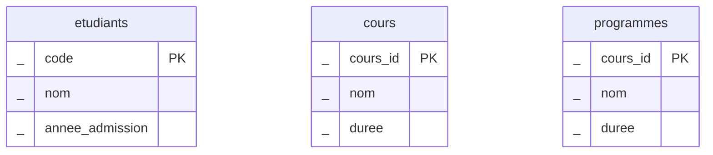
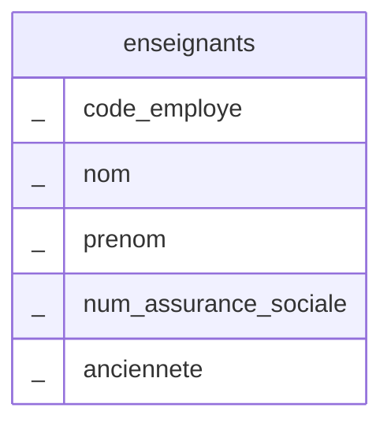

# Composantes d'une BD

Sur un serveur on peut retrouver plusieurs BD. Chaque BD est propre à un système.  
Les BD sont divisées en tables. Les tables contiennent des informations sur une entité.  
Les tables comportent des colonnes (aussi appelés attributs). Chaque colonne décrit un type de données (semblable aux attributs dans une classe).

**Exemple de base de données : Cégep Victo**

Table «etudiants» : nom, code, année d'admission, adresse, etc.

Table «enseignants» : nom, code employé, adresse, etc.

Table «cours» : sigle, nom, etc.

Table «programmes» : nom, code, etc.

## Contenu d'une table

Les tables contiennent des enregistrements qui correspondent à une entrée avec des valeurs indiquées pour chaque colonne.

**Table « etudiant »**

| Code | Nom | Annee admission|
||||
|2345678 | Steve Rogers |2019 |
|3456789 | Nathasha Romanov | 2020|

Les enregistrements peuvent aussi être appelés lignes ou tuples.

## Notation Entité-relation

ERD (_Entity relation diagram_) est un langage permettant d'exprimer graphiquement la structure d'un programme ou d'une BD.

On représente les entités (tables pour une BD) par un rectangle dans lequel on inscrit en haut le nom de la table.

## Tables en diagrammes ER

On remarque que les colonnes (en minuscules) sont écrites dans la boîte sous le nom.



## Trouver un enregistrement

Comment faire pour identifier un enregistrement pour qu'il soit unique?

Marquer une colonne pour forcer chaque enregistrement à avoir une valeur distincte.

Il est important que chaque table ait au moins une colonne unique afin de permettre facilement d'identifier les enregistrements.

## Clé primaire

On indique qu'une colonne est la clé primaire avec la notation

code `<pk>`

À noter: on rassemble en haut les colonnes de clé primaire

``` mermaid
erDiagram  
{!etudiants.mermaid!} 
{!cours.mermaid!}
```

## Identifier les clés candidates


## Comment choisir la clé primaire?

On sélectionne parmi les clés candidates une colonne pour jouer le rôle de clé primaire.

Si aucune colonne ne satisfait les conditions, alors on ajoute une colonne identifiant (ou simplement (nom de la table)\_id) qui sert de clé primaire.

La colonne id sera un nombre entier dont la valeur est auto-incrémentée entre chaque enregistrement.

## :material-cog: --- Exercice 1.2.1 ---

En créant une base de données pour le Cégep, vous devez identifier une clé primaire dans la table suivante. Justifiez votre choix.



## :material-cog: --- Exercice 1.2.2 ---


La compagnie de livraison intergalactique du PlanetExpress souhaite informatiser son service de livraison. Pour ce faire, elle a besoin d'une base de données contenant les informations sur ses vaisseaux de livraison (modèle, immatriculation, chargement, équipage requis) et sur les commandes (nom du destinataire, planète du destinataire, type de livraison , masse de la livraison et date de livraison).

Proposez un digramme ER pour cette BD et identifiez pour chaque table une clé primaire.
