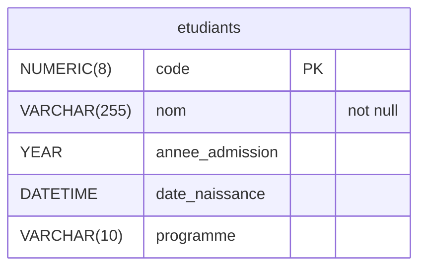

# Intégrité des données

## Contraintes d’intégrité

Une contrainte d’intégrité est une condition à vérifier sur un enregistrement afin de maintenir son intégrité (qu'elle contienne une valeur qui a un sens). Généralement, une contrainte d’intégrité a pour effet de restreindre les valeurs possibles d’une colonne.

### Clé primaire, clé étrangère et valeur par défaut

Les contraintes clé primaire, clé étrangère et valeur par défaut ont déjà été couvertes. On a pu voir que certaines sont spécifiées directement dans la déclaration d’une colonne (**DEFAULT**, **PRIMARY KEY**), tandis que d’autres sont spécifiés sur leur ligne à part (**FOREIGN KEY**, **PRIMARY KEY**). Ajouter un enregistrement ne respectant pas la contrainte déclenche une erreur.

### Rappel des contraintes

Clé primaire : **PRIMARY KEY**
Force la valeur à être unique et est utilisé pour trouver rapidement un enregistrement. Permet l’utilisation par une clé étrangère. Une seule clé primaire permise par table.

Clé étrangère : **FOREIGN KEY**
Référence un enregistrement d’une autre table. Garanti que l’enregistrement existe.

Valeur par défaut : **DEFAULT**
Spécifie la valeur utilisée lorsqu’un enregistrement est créé et qu’aucune valeur n’est spécifiée. Si aucune valeur par défaut n’est indiquée, **NULL** est utilisée par le système.

### Cascade

Jusqu’à présent le code suivant provoque une erreur.

```mysql
DELETE FROM enseignants
    WHERE code_employe = 1;
```

Parce que la table Programme contient une clé étrangère vers Enseignant et qu'elle ne pointerait sur rien si l'enseignant est supprimé.

```mermaid  
erDiagram  
    enseignants ||--o{ programmes : " " 
    {!enseignants.mermaid!}
    {!programmes.mermaid!}
```

La stratégie cascade permet de supprimer tous les enregistrements sont référencés, donc qui posent problème.

Par exemple, ici tous les cours associés aux professeurs seraient également supprimés.

```mysql
FOREIGN KEY (colonne) REFERENCES Nom_table(colonne) ON DELETE CASCADE
```

## :material-cog: --- Exercice 4.1.1 ---

À partir du diagramme Ecole.pdf, identifiez les enregistrements de quelles tables seraient supprimés si toutes les clés étrangères utilisent la stratégie Cascade et que l'on supprime une session.

### Cascade (suite)

La mise à jour en cascade permet de modifier la valeur d’une clé primaire et de mettre à jour simultanément toutes les clés étrangères (conserver l’intégrité).

Utile seulement si la clé primaire n’est pas un identifiant autoincrémenté.

```
FOREIGN KEY (colonne) REFERENCES Nom_table(colonne) ON UPDATE CASCADE
```

### Clé unique

Une clé unique est une façon de préciser qu’une valeur ou un groupe de valeur sont uniques dans la table.

La clé primaire est un type particulier de clé unique.

**ATTENTION** : contrairement à une clé primaire, une clé unique peut être nulle et plusieurs enregistrements peuvent être nuls.

Pour indiquer qu’une colonne est unique, on place le mot-clé UNIQUE après le nom de la colonne.

```mysql
CREATE TABLE programmes (  
    code CHAR(6) PRIMARY KEY,
    nom VARCHAR(255) UNIQUE,
    responsable NUMERIC(8),
    ...
);
```
```mermaid  
erDiagram  
    {!programmes.mermaid!}
```


Pour indiquer une clé unique portant sur plusieurs colonnes, on utilise la syntaxe suivante:

```mysql
CONSTRAINT nom UNIQUE (colonne1, colonne2...)
```

```mysql
CREATE TABLE sessions (
    id_session INTEGER 
      PRIMARY KEY AUTO_INCREMENT,
    semestre ENUM('Automne', 'Hiver'),
    annee YEAR,
    debut_session DATE,
    fin_session DATE,    
    CONSTRAINT semestre_annee_unique 
      UNIQUE (semestre, annee));
```

```mermaid
erDiagram  
{!sessions.mermaid!}
```

### Nullité

À l’exception des clés primaires, toutes les colonnes peuvent prendre la valeur nulle.

On peut empêcher la présence de valeur nulle dans une colonne en ajoutant **NOT NULL** après le type.

Pour éviter des étudiants dont le nom est **NULL**, on ajoute
**| not null** après le type sur le diagramme.

```mysql
CREATE TABLE Etudiant (
    code NUMERIC(7) PRIMARY KEY,
    nom VARCHAR(255) NOT NULL
    ...
);
```




### :material-cog: --- Exercice 4.1.2 ---

Modifiez le script de création de la base de données ecole pour inclure les contraintes suivantes :

A) Deux programmes ne peuvent pas porter le même nom  
B) Chaque programme doit toujours avoir un professeur responsable  
C) Un même numéro de groupe ne peut pas être affecté au même cours à la même session (il y a un seul groupe 1 de BD1 à la session H22)  
D) Si l'on supprime une Évaluation, on veut supprimer toutes les evaluations_etudiants associées.  

### Check

La contrainte **CHECK** permet de vérifier que les valeurs suivent une certaine condition. On insère cette contrainte directement dans la définition de la table.

```mysql
CREATE TABLE Nom_table (
    colonne TYPE,
    ...
    CONSTRAINT nom_contrainte CHECK (condition));
```

Exemple : les pondérations des évaluations doivent être entre 0 et 100.

```mysql
CREATE TABLE evaluations (
  evaluation_id INTEGER 
    PRIMARY KEY AUTO_INCREMENT
  ...
  ponderation NUMERIC(5,2),
  ...
  CONSTRAINT note_0_a_100 
    CHECK (ponderation BETWEEN 0 AND 100));
```

```mermaid
erDiagram  
{!evaluations.mermaid!}
```

### :material-cog: --- Exercice 4.1.3 ---

Insérez une vérification pour vous assurer que :

A) La note obtenue à une évaluation est positive  
B) L'ancienneté d'un enseignant est entre 0 et 50  
C) Les sigles des cours sont dans le format suivant (A est lettre majuscule, # est un entier) : ###-#A#-AA  

### Que peut contenir un CHECK

Certaines colonnes ne peuvent pas faire l’objet d’un CHECK dont:

* Colonne avec l’attribut AUTO_INCREMENT  
* Colonne avec référence d’action (CASCADE).  

On ne peut pas non plus appeler les éléments suivants dans un CHECK :

* Fonction non native ou procédure stockée
* Variable
* Requête
* Fonction non déterministe comme NOW()

Finalement, un CHECK peut contenir les éléments suivants :

* Opérateur arithmétique
* Opérateur de comparaison
* Fonction déterministe (count, avg, year, …)
* Comparaison / opération sur plusieurs colonnes d’une même table.

### Tricher et éviter les CHECK

À l’occasion, on peut vouloir insérer une valeur qui ne respecte pas une condition en raison d’un élément spécial.

On peut utiliser alors les requêtes spéciales avec la clause **IGNORE** :

```mysql
INSERT IGNORE INTO ...
UPDATE IGNORE ...
LOAD DATA INFILE 'nom' IGNORE INTO TABLE ...
```

Comme toute vérification, il faut une bonne raison pour l’éviter !

### :material-cog: --- Exercice 4.1.4 ---

Implémentez, lorsque possible, les vérifications suivantes. Expliquez pourquoi lorsque vous ne pouvez pas les implémenter.

A) Le nom des documents remis n'excède pas 64 caractères (fonction CHAR_LENGTH ?)  
B) La note d’un étudiant n’excède jamais la pondération de l'évaluation  
C) La durée d'une session n'excède pas 17 semaines  
D) Pour une évaluation, tous les étudiants reçoivent une note  
E) Tous les documents sont remis à la date du jour (si je le dépose le 15 mars, alors la valeur dans date_remise est le 15 mars)  

## Ajouter ou retirer des contraintes

On peut modifier les tables pour ajouter ou supprimer des contraintes

```mysql
ALTER TABLE Nom_table
  ADD CONSTRAINT nom TYPE_CONTRAINTE (contrainte)

ALTER TABLE Nom_table
  DROP [PRIMARY KEY | FOREIGN KEY | CHECK] nom
```

### Ajouter une clé primaire

```mysql
ALTER TABLE evaluations
  ADD CONSTRAINT evaluation_pk PRIMARY KEY (id_evaluation);
```

### Ajouter un CHECK

```mysql
ALTER TABLE evaluations_etudiants
  ADD CONSTRAINT note_0_a_100 CHECK (note BETWEEN 0 AND 100);
```

### Supprimer une clé primaire

```mysql
ALTER TABLE evaluations
  DROP PRIMARY KEY;
```
### Supprimer un CHECK

```mysql
ALTER TABLE evaluations_etudiants
  DROP CHECK note_0_a_100;
```